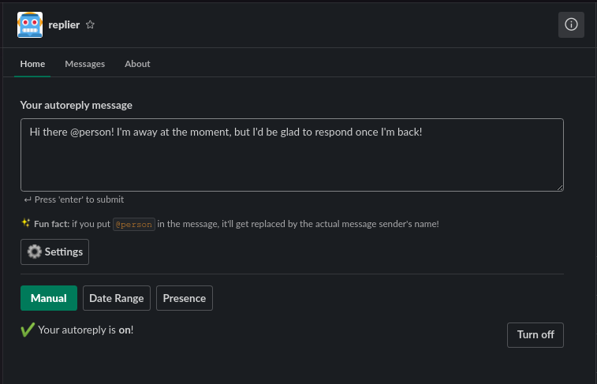

# 🤖 Replier

An autoreply bot for the [Hack Club](https://hackclub.com) Slack! Built using Go, MongoDB, and Docker.

## How it works

You sign in with Slack, configure your autoreply message, hit "Turn On", and Replier handles the rest! 🎉