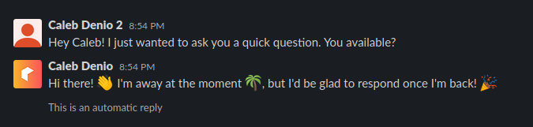

<!-- DO NOT REMOVE - contributor_list:data:start:["cjdenio"]:end -->
# 🤖 Replier

An autoreply bot originally for the [Hack Club](https://hackclub.com) Slack, now available for your workspace! Built using Go, MongoDB, and Docker.

## How it works

You sign in with Slack, configure your autoreply message, hit "Turn On", and Replier handles the rest! 🎉
<!-- DO NOT REMOVE - contributor_list:start -->
## 👥 Contributors

- **[@cjdenio](https://github.com/cjdenio)**

<!-- DO NOT REMOVE - contributor_list:end -->
